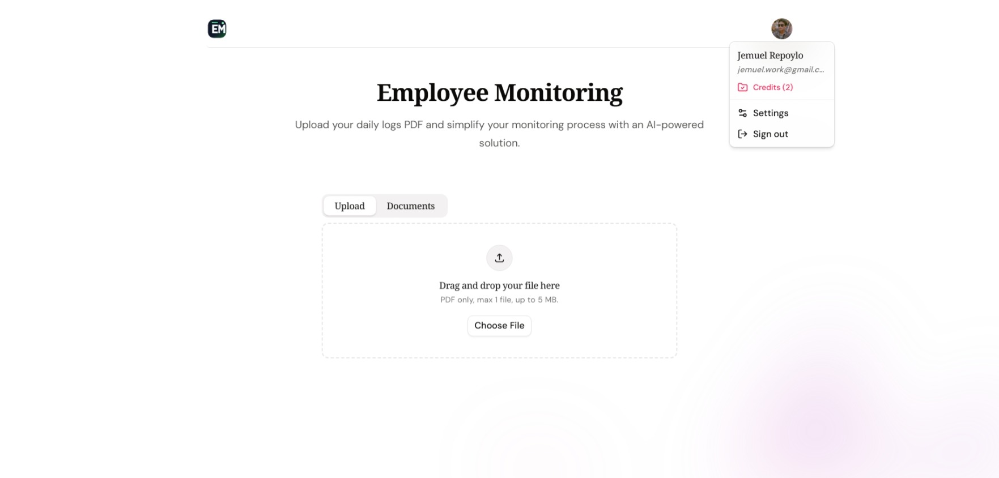
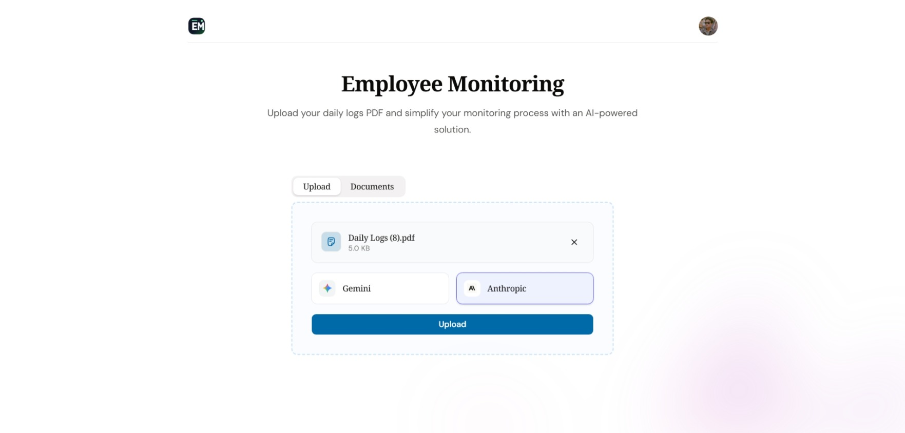
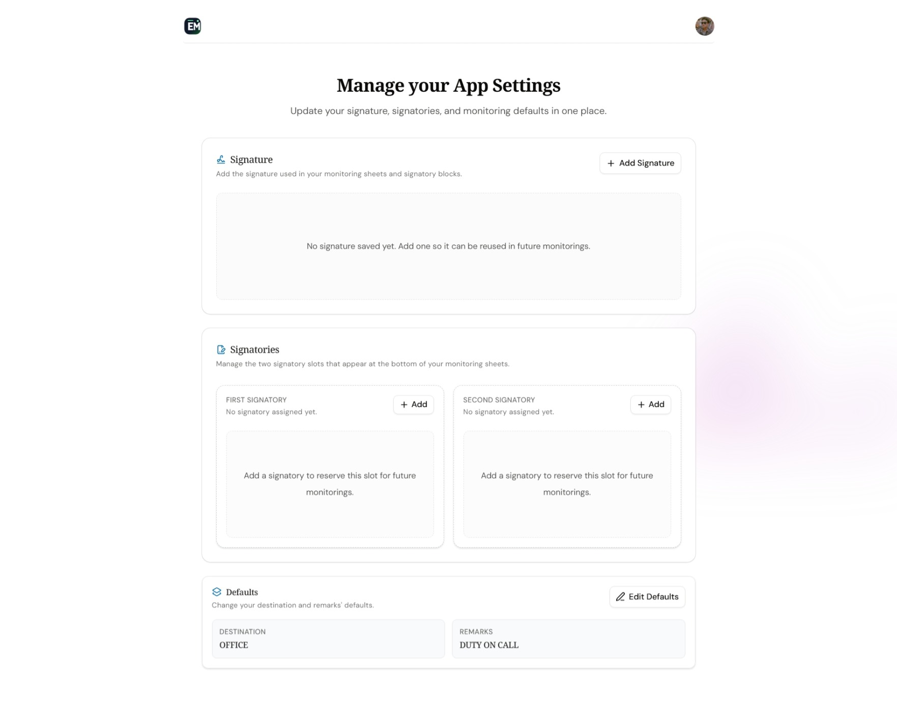

# Employee Monitoring

## Project Context

This is an internal web application built to reduce manual attendance
encoding and standardize how employee work logs are prepared, reviewed, and
printed inside the company.

The system is not meant for public use.

## What I Built and Why

- **AI-assisted PDF extraction**  
  Converts uploaded attendance PDFs into structured log data to remove repetitive manual entry.

- **Work log lifecycle management**  
  Supports create, read, update, and delete operations for attendance records.

- **Reusable signature and signatories profile**  
  Stores signature/signatory defaults per user to keep generated sheets consistent and reduce repetitive setup.

- **Attendance sheet generation for operations use**  
  Produces clean, printable monitoring sheets designed for practical internal handling.

- **Protected access with domain-aware Google auth**  
  Uses NextAuth + Drizzle adapter with optional allowed-domain enforcement for controlled internal access.

## Architecture Understanding

- **Frontend**: Next.js 16 + React 19 + TypeScript + Tailwind + shadcn/ui.
- **Application logic**: Next.js Server Actions for log operations, profile settings, and upload orchestration.
- **Data layer**: Neon PostgreSQL via Drizzle ORM for auth tables, profiles, and work logs.
- **Extraction service integration**: Upload requests are forwarded to an external extraction API (`/api/extract`) with API key authorization.
- **Quota control**: Upstash Redis enforces monthly extraction limits per user to prevent abuse and control cost.
- **Security posture**: Authenticated routes are protected via middleware

## Operational Constraints I Accounted For

- Extraction depends on external API availability (Gemini/Anthropic provider).
- Quota is intentionally strict (monthly cap) to guard API usage costs.

## Screenshots

**Home**  

**Upload**  

**Settings Page**  

## Tech Stack

- **Frontend**: Next.js 16, TypeScript, Tailwind CSS, shadcn/ui, TanStack Query
- **Backend**: Next.js Server Actions
- **Database**: Neon PostgreSQL + Drizzle ORM
- **Authentication**: NextAuth v5 (Google provider)
- **Rate Limiting / Quota**: Upstash Redis
- **External Service**: Flask-based extraction API (Gemini/Anthropic provider option)
- **Deployment**: Vercel
