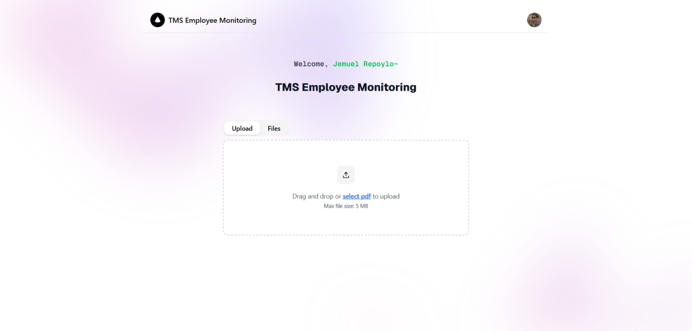
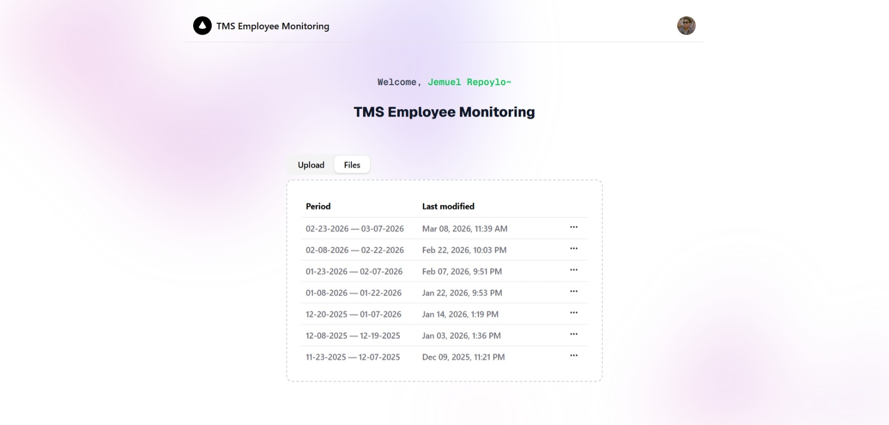
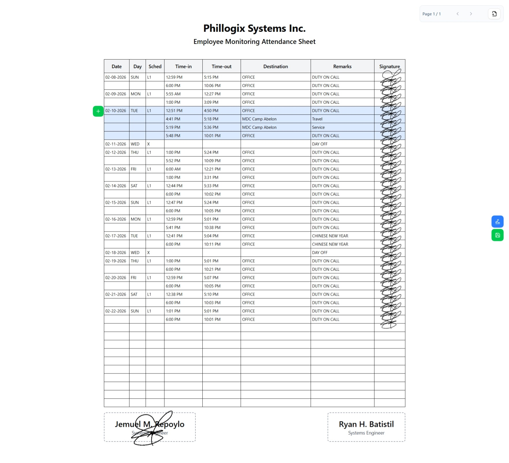
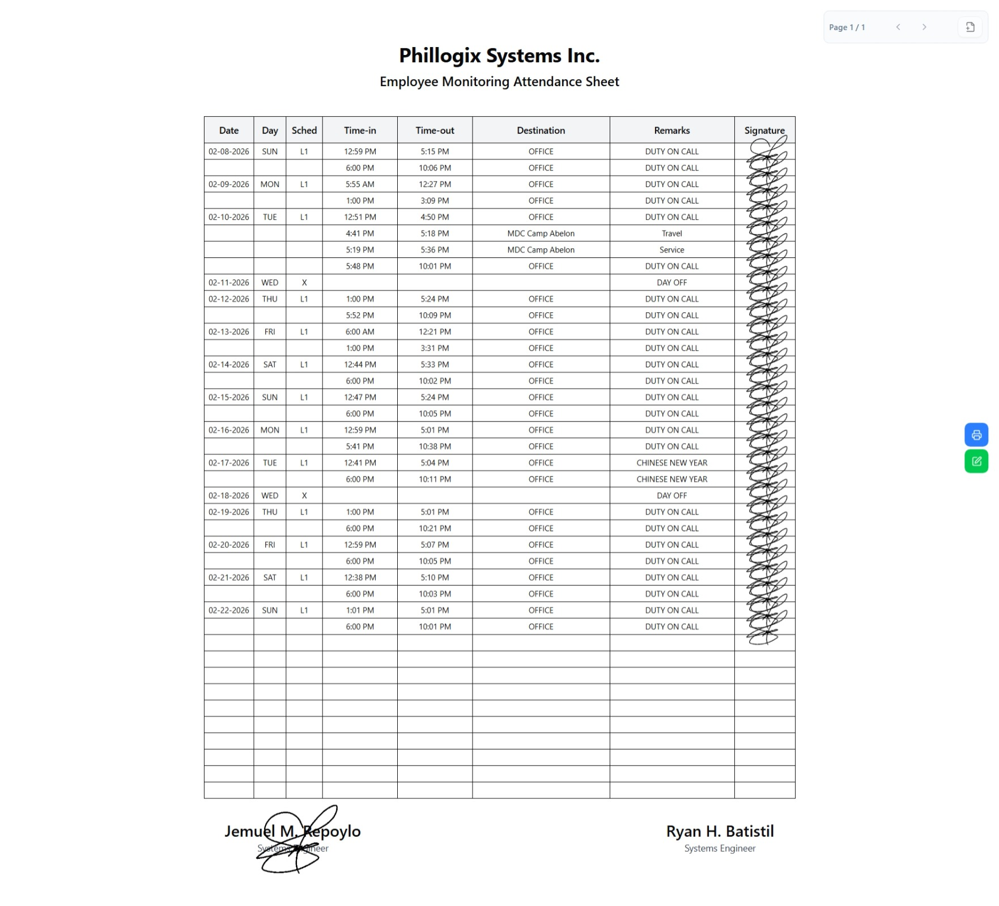

# TMS Employee Monitoring

## Overview

The TMS Employee Monitoring is an independently
developed web application designed to assist with employee attendance
tracking and time management within an organizational environment.

It automates the process of preparing attendance sheets by extracting
data from uploaded PDF reports, while also providing full CRUD operations
for work logs, digital signature management, and secure user
authentication.

Instead of manually writing time-in, breaks, time-out, destinations,
and remarks from Daily Time Records every 15-day cut-off period, users
can upload a PDF attendance report and have the data automatically
extracted, reviewed, and formatted into clean, printable documents.

The system also allows users to capture and reuse digital signatures,
ensuring consistency across documents and reducing repetitive work.

---

## Why This Was Built

Every cut-off period, employees (including the author) were required to
manually transfer attendance data from official attendance records into
monitoring or attendance sheets. This process was repetitive,
time-consuming, and prone to errors.

This project was built to eliminate that manual workload by automating
data extraction and document preparation, while still allowing users to
review and adjust records before final submission.

---

## Key Features

- **PDF Data Extraction**  
  Upload attendance PDF reports and automatically extract time logs
  using AI.

- **Work Log Management**  
  Create, read, update, and delete work logs with full user control.

- **Digital Signature Capture**  
  Capture a signature once and reuse it across future attendance
  documents.

- **Attendance Sheet Generation**  
  Generate clean, readable, and printable attendance sheets with
  applied signatures.

- **User Authentication**  
  Secure login and access control powered by Supabase.

- **Responsive Design**  
  Optimized for both desktop and mobile use.

---

## Screenshots

**Upload Tab**  

**Files Tab**  

**Edit Mode Monitoring**  

**Ready-to-Print / Saved Mode Monitoring**  

---

## Intended Use

This application is intended for internal evaluation and use within an
organizational setting to improve efficiency in attendance reporting
and documentation workflows.

---

## Ownership

This project was independently developed. Ownership, licensing, or
transfer of rights, if any, shall be subject to separate agreement.

---

## Tech Stack

- **Frontend**: Next.js 15, TypeScript, Tailwind CSS, Shadcn/ui, React Query
- **Backend**: Next.js Server Actions
- **External API**: Flask REST API with Gemini AI integration (PDF extraction)
- **Database**: PostgreSQL (Supabase) with Drizzle ORM
- **Deployment**: Vercel
